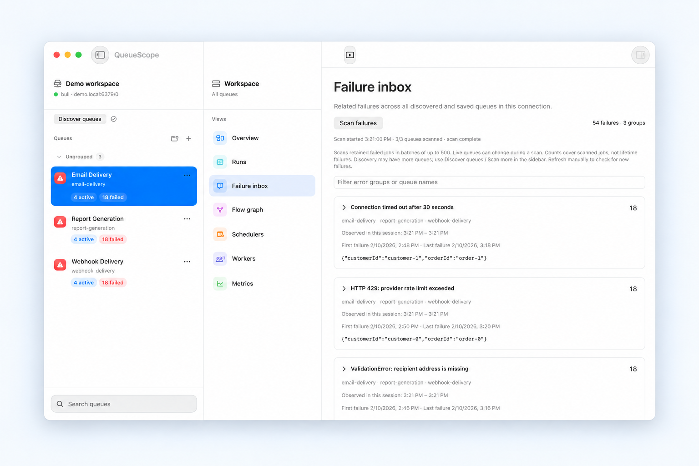

# QueueScope

[Website](https://queuescope.app/) · [Get started](https://queuescope.app/getting-started.html) · [Articles and guides](https://queuescope.app/articles.html) · [FAQ](https://queuescope.app/faq.html) · [Privacy](https://queuescope.app/privacy.html)

```sh
brew install --cask raynirola/tap/queuescope
```

Free, open-source Bull Board alternative for macOS, built with SwiftUI. Inspect failed BullMQ jobs, trace parent/child flows, and connect to private Redis through SSH.

QueueScope targets BullMQ `5.77.x` Redis layouts. It connects directly to Redis for dashboard reads, discovers BullMQ queues and loads saved queues, shows queue health, pages jobs by state, opens job payloads/failures in an inspector, and routes job mutations through BullMQ's official Node package.

Read the [getting-started walkthrough](docs/GETTING_STARTED.md) to try the offline demo, connect through SSH, and investigate failures.

## A Bull Board alternative for native Mac debugging

QueueScope connects to your existing BullMQ Redis queues without replacing workers or deploying a dashboard server. Start with a read-only profile, group retained failures, inspect job evidence, and follow dependencies. The packaged app includes its Node runtime; release credentials stay in macOS Keychain.

Need a shared browser dashboard or legacy Bull support? Compare the documented workflows in [QueueScope vs Bull Board and Workbench](https://queuescope.app/bull-board-alternative.html). Workbench also offers a Mac client; QueueScope focuses on a native SwiftUI workflow with SSH connections and failure grouping.



## Current Features

- Native SwiftUI three-pane macOS interface.
- Redis URL connection with `redis://` and `rediss://` parsing.
- Saved connection profiles with credentials in macOS Keychain in release builds; prompt-free, separate local storage in development builds.
- SSH tunnels using system OpenSSH, existing keys/agent, and verified known hosts.
- Connection diagnostics, automatic first-connection discovery, and a read-only offline demo.
- Failure inbox grouping retained errors across queues, with incremental scans and representative job inspection.
- Queue discovery by prefix, plus manually added queues and saved display names/groups.
- Exact job ID lookup and incremental name, failure-text, state, and creation-date filtering.
- Configurable automatic refresh with last-updated, stale, and refresh-failure indicators.
- Read-only connection profiles and queue pause/resume controls.
- Parent/child flow graphs with cross-queue job inspection.
- Queue counters for waiting, active, delayed, prioritized, completed, failed, paused, and waiting-children.
- Runs table by state with job id, name, attempts, duration, and payload preview.
- Job inspector for payload, options, progress, return value, failure reason, stack trace, and timestamps.
- Job actions for retrying completed/failed jobs, promoting delayed jobs, removing non-active jobs, and duplicating jobs with editable data/options.
- Local metric snapshots scoped to the Redis host, port, database, prefix, and queue, without writing to Redis.
- Scheduler discovery and live named worker connections from Redis CLIENT LIST.
- Sparkle-backed manual app update checks.

## Job Actions

QueueScope keeps direct Swift Redis access read-focused. Mutating job actions run through `BullMQActionBridge/bridge.mjs`, a small Node helper that uses the official `bullmq` package for `Job.retry`, `Job.remove`, `Job.promote`, `Queue.add`, `Queue.pause`, and `Queue.resume`.

The Xcode build packages the bridge and its locked production dependencies into `QueueScope.app`, so people using the built app do not run `npm install`. The build machine needs npm available so the `Package BullMQ action bridge` build phase can install the locked bridge dependencies into the app bundle. The app bundles a pinned Node runtime, so job actions work without a separate Node installation. `BULLMQ_NODE_PATH` can override it for development; Homebrew, `/usr/local`, `/usr/bin`, and nvm are fallback locations for older bundles; set `BULLMQ_ACTION_BRIDGE_PATH` only when deliberately overriding the packaged bridge during development.

Job actions have a 30-second deadline and support task cancellation. The app drains stdout and stderr while the bridge runs, with a 1 MiB limit per stream. If execution is interrupted, the action may already have reached Redis: refresh and inspect the job before retrying.

## Browsing and Operations

- **Discovery:** choose Discover queues in the sidebar. Scans use the connected prefix and preserve saved groups and display names. If more Redis keys remain, choose Scan more.
- **Search:** open a job directly by ID, or combine name/failure-text filters with state selection and optional creation dates. Search reads up to 500 job entries per request; Search more continues from the previous position. Results are not a snapshot: jobs can move between states while you browse. Automatic refresh pauses during a filtered search so it does not discard your progress; Refresh reruns the search.
- **Refresh:** choose Manual, 5, 15, 30, or 60 seconds. The interval is saved per connection. Polling runs only while the app is active and no other operation is in progress, and pauses after a refresh failure. The last successful refresh remains visible with a stale/error indicator.
- **Read-only:** enable Read-only connection before connecting or saving a profile. The setting applies to the connected session; editing the form does not change its permissions. All mutations are rejected before launching the bridge, including bulk actions and queue pause/resume. This is an app safeguard; use Redis ACLs when server-enforced permissions are required.
- **Pause/resume:** pausing stops new jobs from being claimed; currently active jobs may finish. Both operations require confirmation and use BullMQ itself.
- **Workers:** lists actual named BullMQ worker connections in the selected Redis database. It requires CLIENT LIST permission and providers that support worker client names. Connection presence does not prove processing activity; worker concurrency or processed-job counts are not inferred.
- **Flows:** enter a job ID in Flow graph or choose View parent and child jobs in the inspector. The graph includes ancestors and the selected job's descendants across queues. Select a node to inspect it. Each graph is limited to 80 jobs, eight ancestor levels, and six descendant levels, with a partial-graph notice when truncated. Open a descendant's flow to explore that branch. Jobs under another prefix can be inspected, but their mutations are disabled; connect to that prefix to operate on them.

## Local Data

Redis URLs are masked in the connection editor until explicitly revealed. In release builds, profile metadata is stored in preferences and complete connection URLs are stored in Keychain. Debug builds use separate unencrypted local storage and never read release Keychain entries; save development profiles once to avoid repeated authorization prompts. Existing plaintext profiles migrate only after their Keychain writes succeed. A Keychain failure preserves the original data and reports an error.

Metric history lives at `~/Library/Application Support/QueueScope/metrics-v2.json`. It retains up to 120 snapshots per connection/queue and caps the active file at 4 MiB. Only the newest snapshot per queue carries native metrics, limited to the latest 1,440 minute buckets supported by the charts. Old snapshots without a connection identity are archived alongside that file as `metrics-legacy-*.json`; they are not mixed into current charts.

Switching connections disconnects the previous session before attempting the next one. Editing a profile's prefix does not change an already connected session. Connection switches are blocked while a job mutation is running.

## App Updates

QueueScope uses Sparkle 2 for direct-distribution app updates. The app checks the GitHub Releases appcast only when `Check for Updates...` is selected:

```text
https://github.com/raynirola/queuescope/releases/download/appcast/appcast.xml
```

The Sparkle public EdDSA key is embedded in the app. The private signing key stays on the release machine and is required when generating release appcasts.

Release flow:

1. Build a Release archive of `QueueScope.app`.
2. Sign and notarize the app.
3. Package the notarized app as a `.zip` or `.dmg`.
4. Run Sparkle's `generate_appcast` tool over the folder containing the packaged update archive.
5. Upload the update archive and generated `appcast.xml` to the GitHub release tag named `appcast`.

Until `appcast.xml` exists at the release URL, `Check for Updates...` may show Sparkle's standard feed-not-found error.

## Run

Open the Xcode project:

```sh
xed BullMQDashboard.xcodeproj
```

Select the `BullMQDashboard` scheme and press Run. The app builds as QueueScope.

## Test

Use Xcode with Swift 6 support and Node.js/npm. Install Redis locally to run transport and BullMQ integration tests. The tests start their own loopback Redis processes; they do not use saved connections. Swift transport tests are skipped if Redis is unavailable.

```sh
xcodebuild -project BullMQDashboard.xcodeproj -scheme BullMQDashboard -configuration Debug -destination 'platform=macOS' test
npm ci --prefix BullMQActionBridge
npm test --prefix BullMQActionBridge
```

For a build without a developer signing identity (also used in CI):

```sh
xcodebuild -project BullMQDashboard.xcodeproj -scheme BullMQDashboard -configuration Debug -destination 'platform=macOS' DEVELOPMENT_TEAM='' CODE_SIGN_IDENTITY=- ENABLE_HARDENED_RUNTIME=NO test
```

Tests use isolated preferences, temporary metric files, and an in-memory credential store. The feature integration fixture creates jobs, workers in two databases, and cross-queue flows using the bundled BullMQ package, then exercises the Swift read engine and mutation bridge. The app host does not open the dashboard or restore a saved connection during XCTest. Set `REDIS_SERVER_PATH` or `BULLMQ_NODE_PATH` if the executables are outside the supported locations.

## Architecture

- `App`: app entrypoint and shared state.
- `UI`: SwiftUI sidebar, dashboard, tables, charts, and inspector.
- `Domain`: BullMQ models, parsing, engine protocol, state enums.
- `BullMQRedisEngine`: pure Swift direct Redis read engine plus a narrow BullMQ mutation bridge client.
- `Persistence`: connection profiles, workspace preferences, queue metadata, and local metric snapshots.

The UI talks to `BullMQEngine`, keeping Redis reads and BullMQ-backed writes behind one replaceable interface.

## License

QueueScope is open-source software licensed under the [MIT License](LICENSE).

## Safety

Dashboard refreshes use read-style Redis commands such as `SCAN`, `LLEN`, `ZCARD`, `LRANGE`, `ZREVRANGE`, and `HGETALL`. Job mutations are limited to the inspector actions and are delegated to BullMQ itself, so locked jobs, wrong-state retries, and invalid promotions fail with BullMQ errors instead of hand-edited Redis state.
